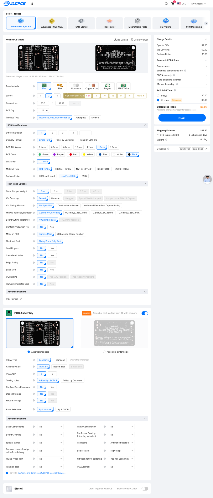
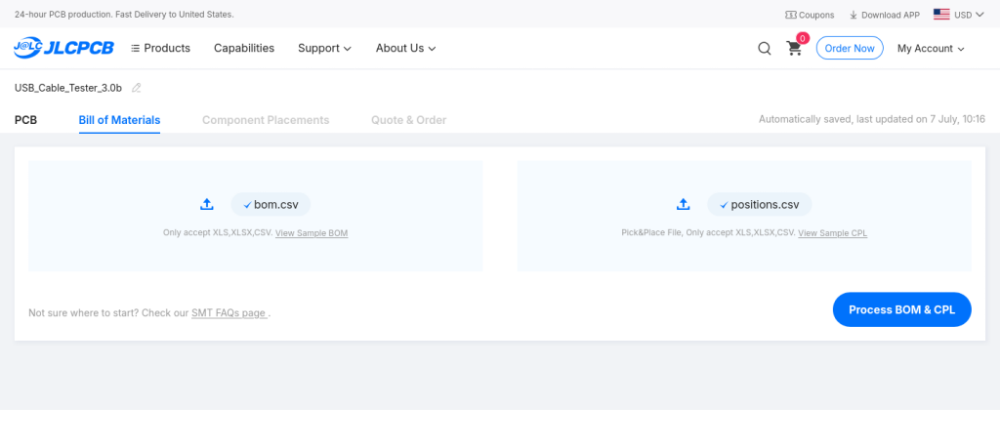
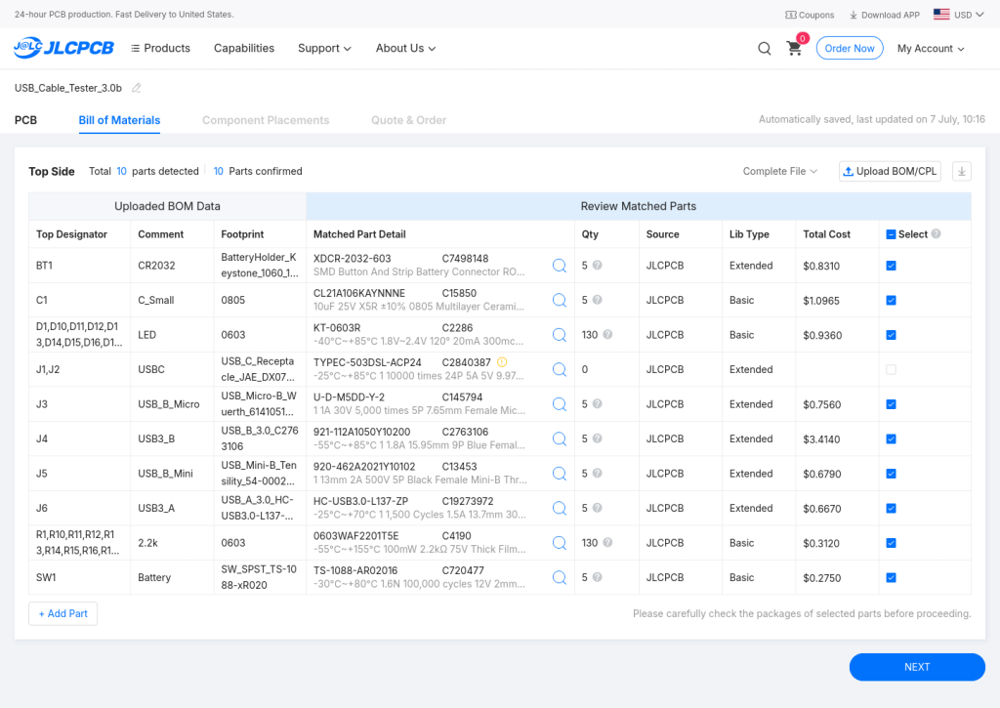
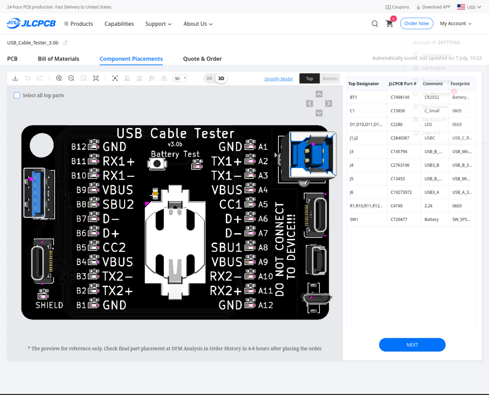
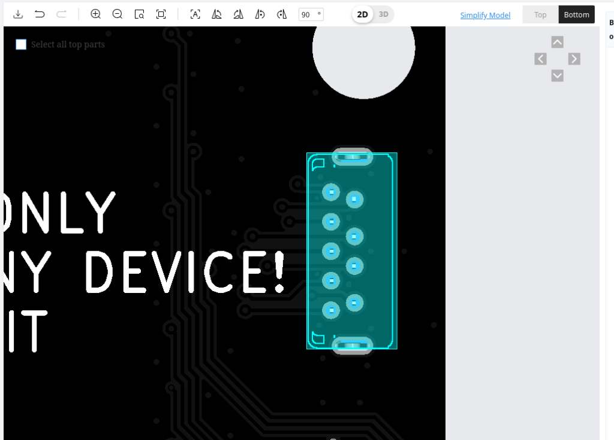
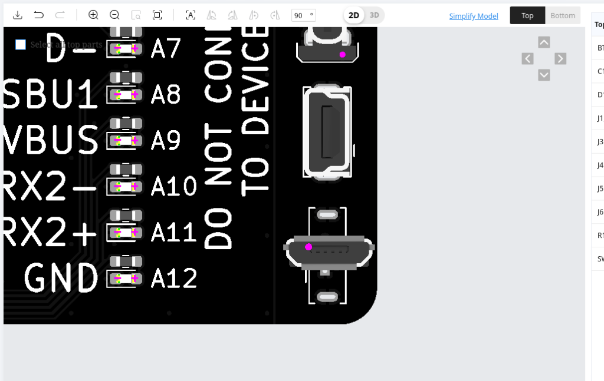
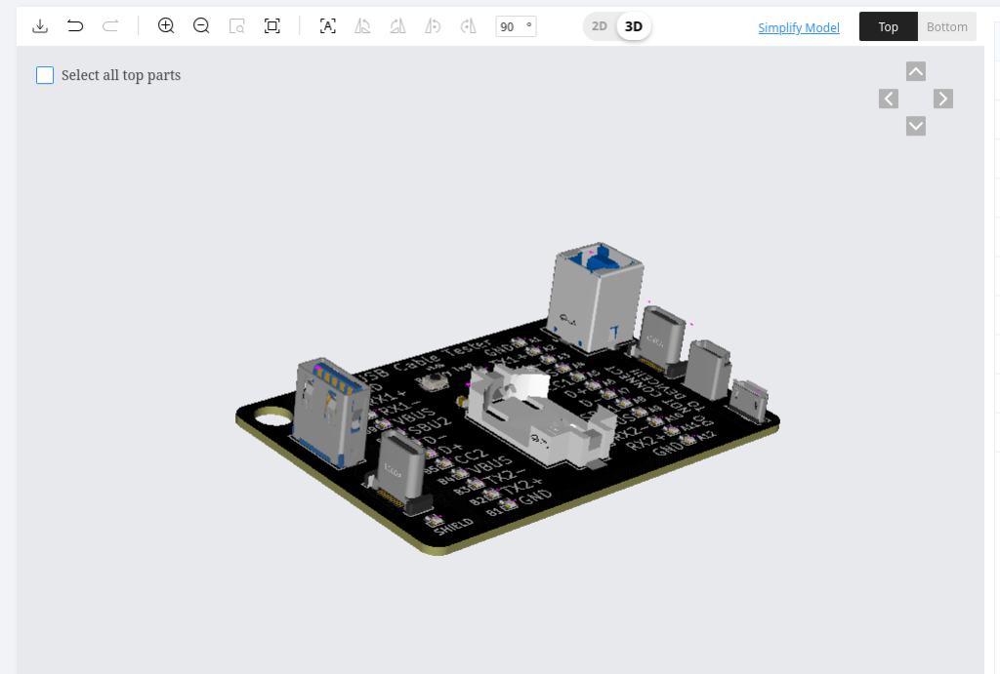
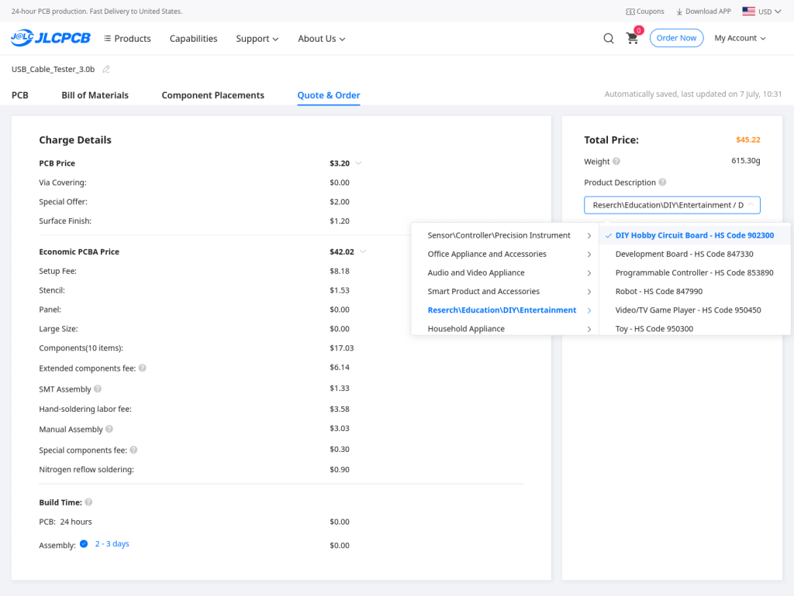
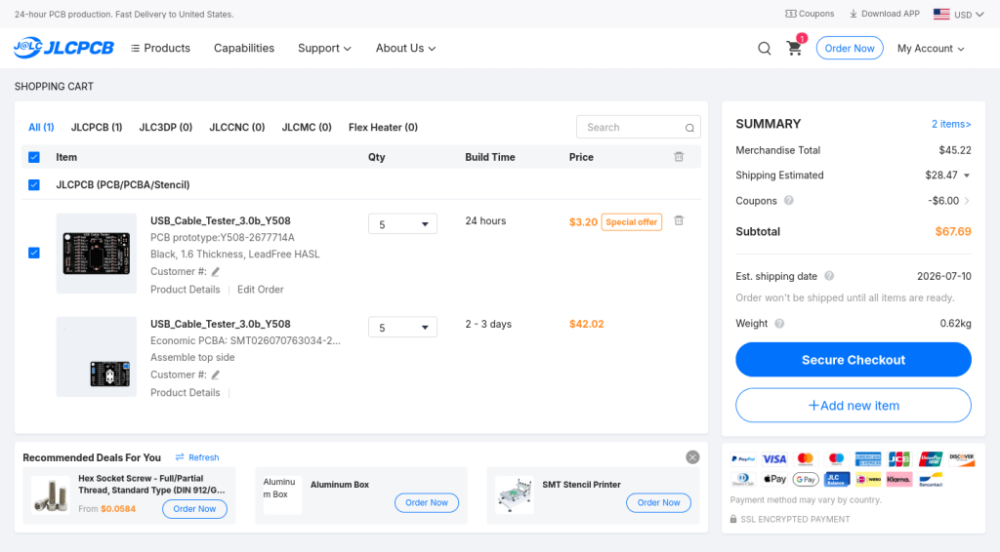

# Ordering Instructions for v3.0 boards on [JLCPCB](https://jlcpcb.com/) — vertical variant

This is the v3.0 design with **vertical connectors** and through-hole parts where possible.  Assembly can either be done by hand, or using JLCPCB.

If you intend to assemble by hand, follow this process up to "PCB Assembly".  Order the boards, but skip the assembly process.  Then look at the very bottom of this document for information on sourcing parts.

## Generate Files

This directory contains the KiCad source only. Generate the manufacturing files from
`usb_c_cable_tester.kicad_pcb` in this folder.

* Install the **Fabrication Toolkit** plugin to KiCAD.
* Tools → External Plugins → Fabrication Toolkit.
* Make sure the following is checked:
  * Apply automatic fill for all zones
* Uncheck the following:
  * Open browser after generation
  * Generate backup files
* The rest aren't important. Click **Generate**

This generates the following files you'll use below:

* Gerbers: `production/USB_Cable_Tester_[version].zip`
* Bill of Materials: `production/bom.csv`
* Positions: `production/positions.csv`
* ...and a few others you won't use.

## Upload Gerbers and Select PCB Parameters

Go to JLCPCB, click on "instant quote" or "order now" and upload the gerber zip in the `production/` folder.

Select the following settings (or change how you like them)

* ENIG will look better, but it's a bit more expensive. I definitely recommend lead free HASL at the very least
* Choose your color, it's free.  :-)
* All other defaults are fine.

> **If you intend to assemble the board yourself, then DO NOT select "PCB Assembly" and proceed straight to the "Checkout!" step below.**

If you DO intend to use JLCPCB for assembly, then continue.  Near the bottom of the page, select "PCB Assembly" and select the following settings (or change how you like them):

* PCBA Type: **Economic**
* Assembly Side: **Top Side**
* All other defaults are fine.

Click **Next**

The next page lets you review your board.  Click **Next** again.

## Upload BOM and Placement files

Upload the `bom.csv` and `positions.csv` files.  Click on the "Upload" buttons and select the files from earlier.

Click **Process BOM & CPL**

## Verify Bill Of Materials

Verify the BOM.  The important part to verify is that all parts are available and selected.  If a part is no longer available, you'll have to find a suitable replacement.

Some parts (J1,J2 shown below) might have a yellow notification icon, and be unselected.  In this case, it's because the USB-C sockets require a $0.03 upcharge because they're difficult to place.  The important part here is to make sure you select the part for assembly, the blue check box on the far right.

Click **Next**

## Fix Component Placement

Verify component placement (it's not quite right by default).  Rotate and move parts so that the pins line up in the holes correctly.

Then select each USB connector and use the arrows on the top right to move it into place.  Change the view to "2D" and "Bottom" and make sure the pins line up with the holes.

At time of writing, the MicroUSB socket defaults to rotated 90 deg.  Rotate it and line it up:

The 3d view is also quite useful when trying to line things up

Click **Next**

## Quote & Order

The next page shows you a breakdown of costs.  You'll need to provide a "Product Description."  I pick something in the "DIY" category.

Click **Save To Cart**

## Checkout!

## Additional Notes

### All pins soldered together

[There have been reports](https://github.com/alvarop/usb_c_cable_tester/issues/15) of JLC asking if all the pins on one side should be shorted together. The answer is yes, this is on purpose :D

### Ordering parts for manual assembly

The bill of materials (bom.csv) contains parts, descriptions, and LCSC part numbers.  For common parts like the resistors and LEDs, you can buy just about any alternative from Mouser, Digikey, eBay, etc.

However, some of the USB sockets (mostly USB-C) have very specific board layout requirements.  I suggest you buy those parts from LCSC, using the LCSC part numbers in the BOM.  Alternatively, if you try to find a different source, make sure the footprint is the same.  You can find the footprint drawings in the data sheet linked to from the LCSC page for the parts.
